# ID/Pass 選定

- 選定候補と、どれを選定したかを簡単に最初に述べます。
- その後、個別に選定に至った実際の使用感などを解説します。

## 0. 候補

1. AWS Key Management Service (KMS)
2. AWS Systems Manager パラメータストア
3. AWS Secrets Manager

### 0.1. 選定

- 3. AWS Secrets Manager を採用する。

### 0.2. 選定理由

**Secrets Manager** が一番後発（2018 年 4 月～）となり、他の 1、2 を包含した機能となっている。  
今後も発展するならここっぽいので、AWS というプラットフォームの中で隠蔽ものはここに集約するという意思を感じる。  
画面が一番使いやすいっていうのもある。

## 1. KMS について

まぁ特になし。定番。  
[https://aws.amazon.com/jp/kms/](https://aws.amazon.com/jp/kms/)

### 1.1. 自分の評価

- System Manager パラメータストア や、AWS Secrets Manager から呼び出されており、AWS 的に処理の終端側に追いやられている。
- 暗号化には特化しているものの、ローテーションなどの機能はないため、将来を考えるともうちょっと上流であるパラメータストアや Secrets Manager を利用したほうがよいのではないか。

## 2. AWS Systems Manager パラメータストア

[AWS Systems Manager パラメータストア](https://docs.aws.amazon.com/ja_jp/systems-manager/latest/userguide/systems-manager-parameter-store.html)

以下引用

> AWS Systems Manager パラメータストア (パラメータストア) は､設定データ管理と機密管理のための安全な階層型ストレージを提供します。  
> パスワード、データベース文字列、Amazon Machine Image (AMI) ID、ライセンスコードなどのデータをパラメータ値として保存することができます。  
> 値はプレーンテキストまたは暗号化されたデータとして保存できます。  
> パラメータの作成時に指定した一意の名前を使用して、スクリプト、コマンド、SSM ドキュメント、設定および自動化ワークフローの Systems Manager パラメータを参照できます。

### 2.1. 自分の評価

- なんか一昔前の AWS コンソール画面のママ放置されていて、メンテほったらかされてる感あり。使いやすくない。
- パラメータストアと Secrets Manager は、結局どっち？ 論争があるが、あくまでも SystemsManager の一部の機能であり、ここを使用するならまず SystemsManager と向き合って、そこの仕組みを十全に引き出す中で使うべき。
- 2018 年 4 月より前の主力。それ以降は次項の AWS Secrets Manager が主流となりそう。
- ちなみに KMS 呼び出してるので、KMS 使うならここ経由にしても良い。

### 2.2. 画面

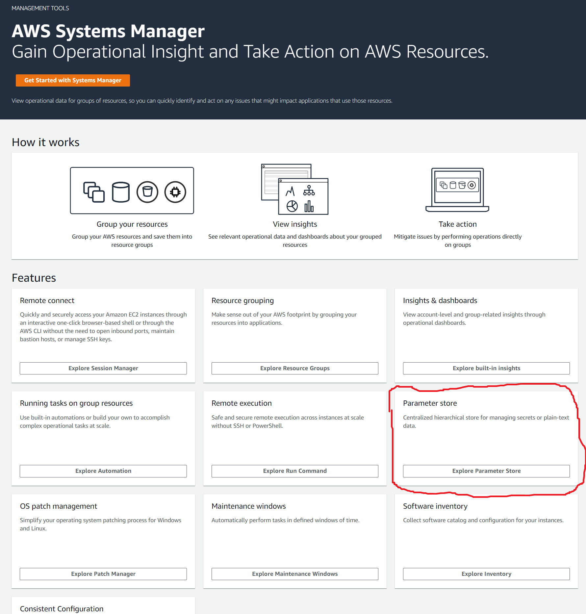  
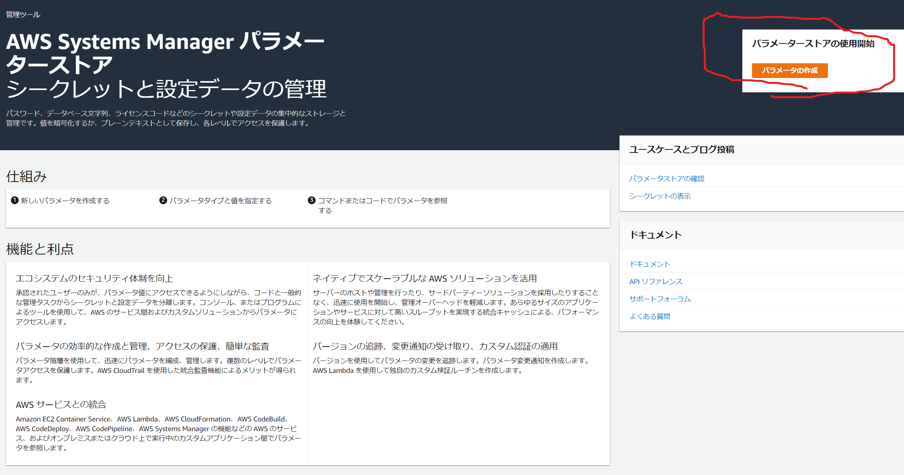  
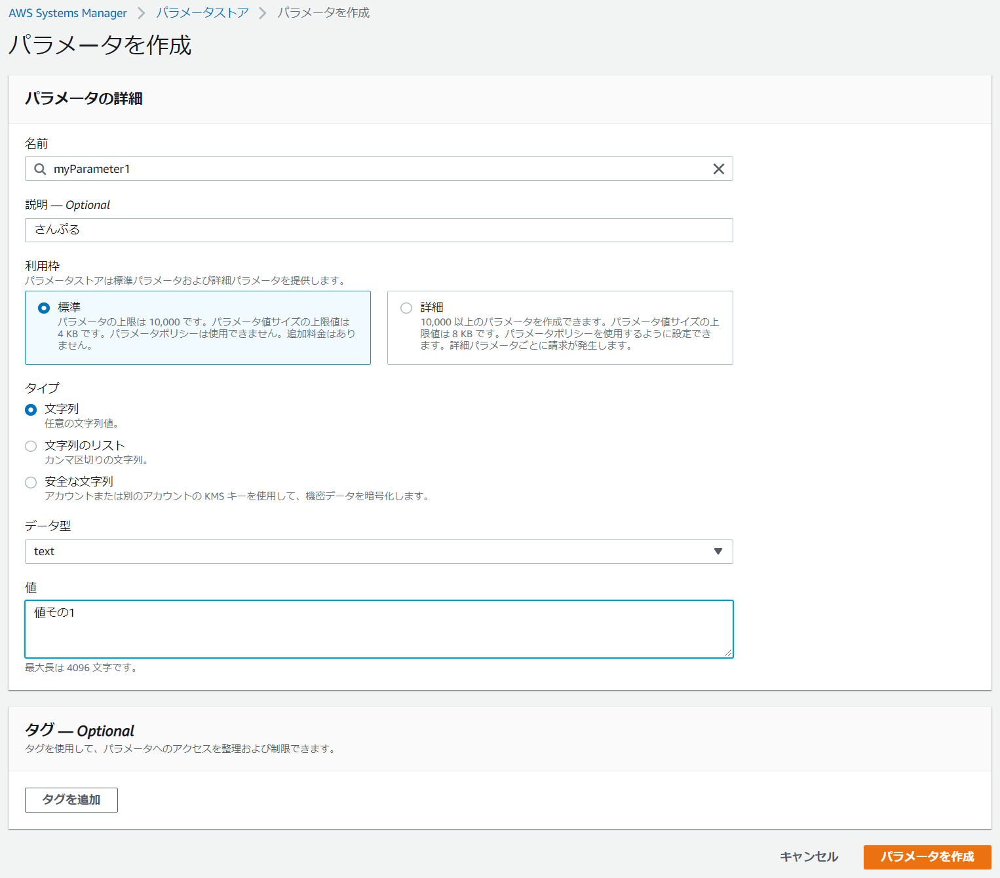  
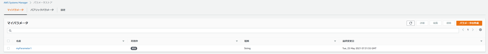  
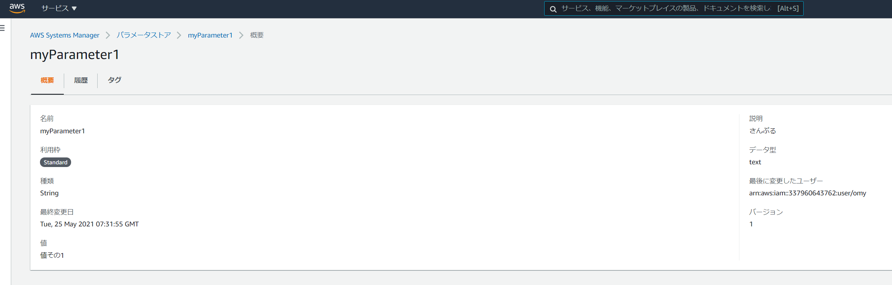

## 3. AWS Secrets Manager

[AWS Secrets Manager](https://ap-northeast-1.console.aws.amazon.com/secretsmanager/home?region=ap-northeast-1#!/home)

以下引用

> データベースクレデンシャル、API キー、OAuth トークンなどのシークレットへのアクセスを保存、ローテーション、監視、および制御を行うには、Secrets Manager を使用します。  
> Amazon RDS で MySQL、PostgreSQL、および Amazon Aurora の組み込み統合機能を使用してシークレットローテーションを有効にします。  
> AWS Lambda 関数を使用して、任意のシークレットのローテーションを有効にすることもできます。  
> シークレットを取得するには、アプリケーション内のハードコードされたシークレットを Secrets Manager API への呼び出しに置き換えるだけで、プレーンテキストのシークレットを公開する必要がなくなります。

### 3.1. 自分の評価

- 今回の要件と一番合致する AWS 提供の機能。
- 暗号化だけなら前述のどれを使ってもよいのだが、そもそもちゃんと管理をするならここの標準の機能に沿うだけで良いという簡便さがある。
- キーワードのローテーションは任意だが、本番環境ではローテ有効、開発では無効とする、など、柔軟に対応可能。
- 将来的に Secret とはなにか、と解釈が将来変わったとして、AWS として対応していくのはこの範囲となる気配があるため、ここにベットしておくという視点もよし。
- この資料では、外部の DB ツール（A5M2）の接続方法などもいちおう説明する。

### 3.2. 画面

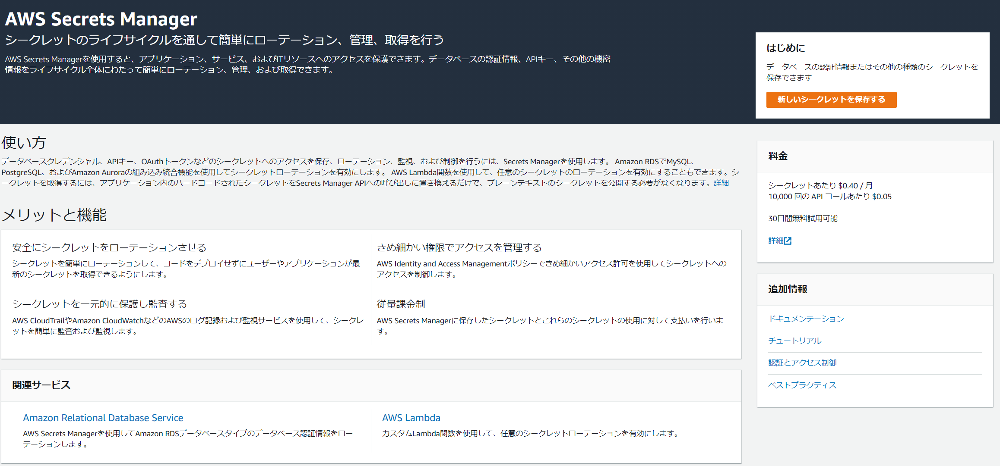
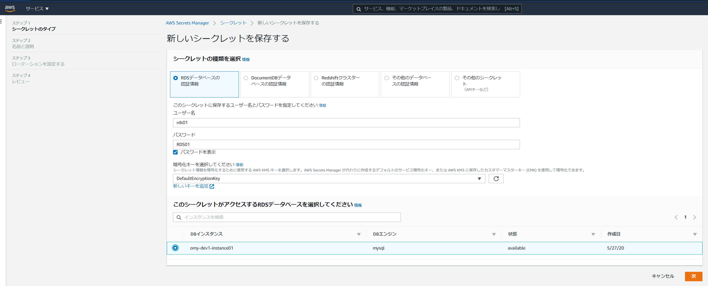  
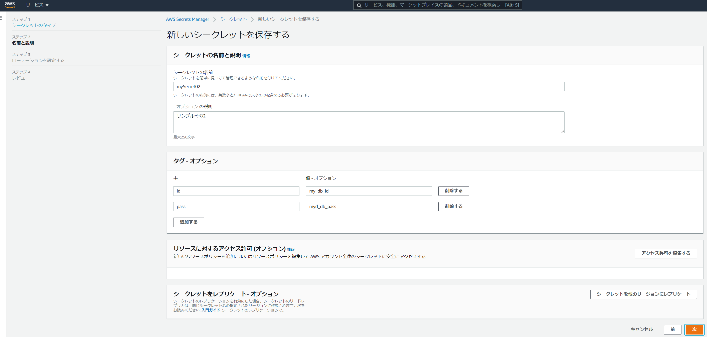  
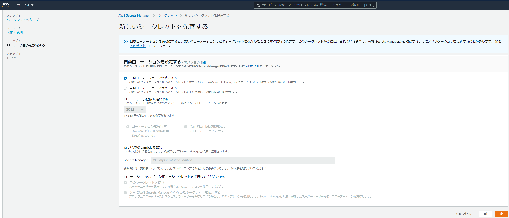

## 4. ここからは Secrets Manager を使用した色々

### 4.1. 前提

- EC2 と RDS を用意。
- RDS の 接続情報を Secrets Manager で隠蔽

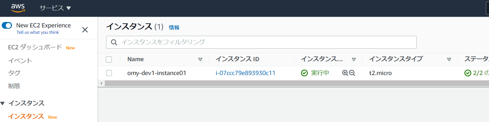  
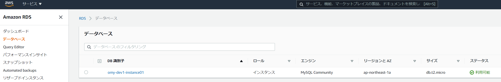

- 以下、通常は先に ない時 を書くべきですが、大阪人が「あるときから先に言うべき」とうるさいので。551 ルール。

### 4.1. Secret Manager があるとき

- EC2 からふつーに接続 **できない** ことを確認。もう AWS 内ではシークレット化してますゆえ。  
   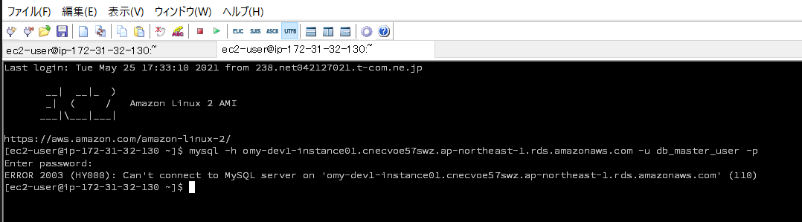
- AWS CLI を利用して、シークレット越しに RDS 接続ができることを確認。
  - EC2 を色々操作するのですが、とにかくめんどくさかったのでパス。Python2 と Python3 の競合と AWS CLI2 の競合がぶつかったりして。
  - ぐぐるとたくさん成功例やサンプルが出るので、もう OK ということで。
    - [【初心者】AWS Secrets Manager と AWS Systems Manager Parameter Store を使ってみる](https://qiita.com/mksamba/items/0080a342de180120073b)
    - [【AWS Secrets Manager】プライベート環境で EC2 インスタンスから RDS に接続](https://5hintaro.com/tech/aws-secrets-manager-privateinstance-access/)
- ツールから接続できることを確認。こちらは AWS エコシステム外なので大丈夫。  
   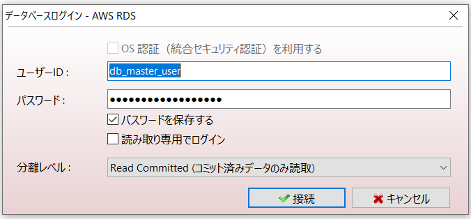  
   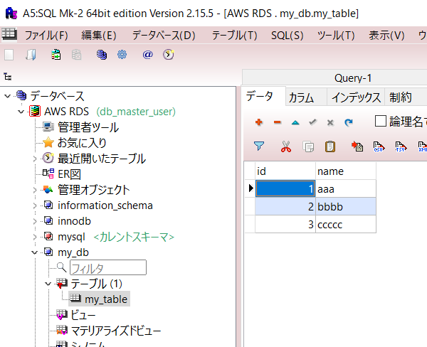

### 4.2. Secret Manager がないとき

- EC2 に入ってみる。  
   
- RDS 接続ができることを確認。  
   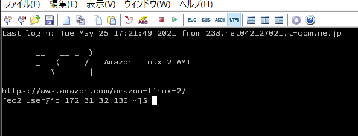
  - ふつーにやると接続できますが、あるとき を先にやってしまうと、シークレットを削除指示を出して本当に削除されるまでシークレットが生きてる状況となってしまい、画面取れませんでした。
- ツールから接続できることを確認。めんどいので画像使いまわし w 実際繋がるんで大丈夫っす。  
     
   

## 5. 料金比較

### KMS

- 10,000 件のリクエスト当たり 0.03USD
- 10,000 件の RSA 2048 キーを含むリクエスト当たり 0.03USD
- 10,000 件の ECC GenerateDataKeyPair リクエスト当たり 0.10USD
- 10,000 件の RSA 2048 を除く非対称のリクエスト当たり 0.15USD
- 10,000 件の RSA GenerateDataKeyPair リクエスト当たり 12.00USD
- 無料利用枠 : AWS Key Management Service は、サービスが利用可能な全ての地域における合計 20,000 件のリクエスト/月の無料利用枠を提供します。

### パラメータストア

- 料金 – パラメータストア
  - スタンダード 追加料金なし
  - アドバンスド 1 か月ごとにアドバンスドパラメータ当たり 0.05 USD (パラメータの保存期間が 1 か月に満たない場合は 1 時間ごとに按分されます)
- 料金 – API インタラクション
  - スタンダード 追加料金なし パラメータストア API インタラクション 1 万回ごとに 0.05 USD
  - アドバンスド パラメータストア API インタラクション 1 万回ごとに 0.05 USD パラメータストア API インタラクション 1 万回ごとに 0.05 USD

### AWS Secrets Manager

- シークレットあたり 0.40USD/月。レプリカシークレットは個別のシークレットとみなされ、レプリカごとに 1 か月あたり 0.40USD で請求されます。保存期間が 1 か月未満のシークレットについては、料金は (時間数に基づいて) 案分計算されます。

- 10,000 件の API コールあたり 0.05USD。

### 課金総評

ちょっと多めに使うぐらいで ～ 10,000 円ぐらいじゃないでしょうか。  
会社の金ならどれでも気にしないでいいぐらいの金。  
当たり前だけど使えば使うほど掛かるので、ある程度見てからの調整は必要。
