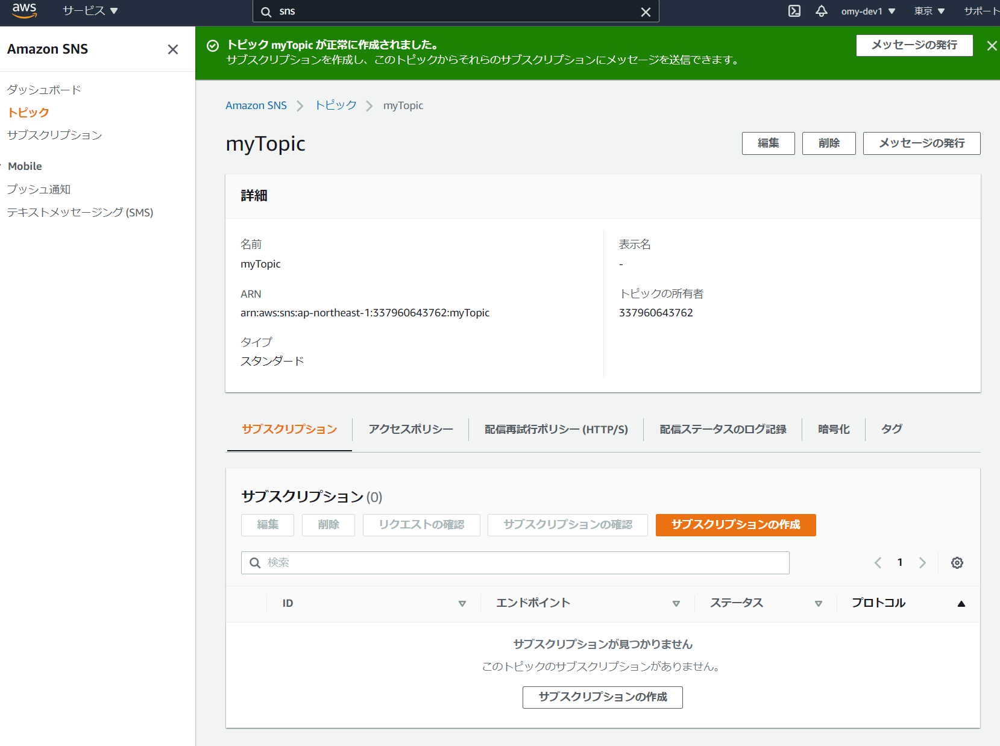

# キューイング選定

- 選定候補とどれを選定したかを最初に述べます。１行ぐらいで。
- どのように設定するのかを記載します。SNS、SQS、Lambda で。
- 外部サービスについてかんたんに一例を出します。

## 0. 候補

1. AWS → SQS のみ
2. SNS → SQS → Lambda  
   → Lambda  
   → Push 通知など
3. EC2（Kafka）
4. Amazon MSK（Amazon Managed Streaming for Kafka）
5. Amazon Kinesis

### 0.1. 選定

水曜日に話した感じだと 2 採用。
この概念で行く。  

## 1. SNS

### 1.1. 概要

- マネージド pub/sub メッセージングサービス、とのこと。
- [https://docs.aws.amazon.com/ja_jp/sns/latest/dg/welcome.html](https://docs.aws.amazon.com/ja_jp/sns/latest/dg/welcome.html)
- Notification がすべてを表してると思う
- 過去事例では APNs、FCM で Push 通知した。
- SQS 連携ももちろん OK

### 1.2. SNS 設定

1. AWS で SNS 画面へ行く  
   
2. トピックを作成、確認する  
   
   
3. サブスクリプションを作成、確認する。SQS との紐付けもついでにやってしまう。  
     
   
4. Lambda とかもくっつく  
   

### 1.3. 料金体系

| エンドポイントの種類         |                                                           無料利用枠                                                            |             料金             |
| :--------------------------- | :-----------------------------------------------------------------------------------------------------------------------------: | :--------------------------: |
| モバイルプッシュ通知         |                                                         100 万件の通知                                                          |      0.50USD/100 万通知      |
| SMS                          |                                         100 件の通知（米国の電話番号に送信される SMS）                                          |             詳細             |
| Email/Email-JSON             |                                                         1,000 件の通知                                                          |      2.00USD/10 万通知       |
| HTTP/S                       |                                                          10 万件の通知                                                          |      0.60USD/100 万通知      |
| Simple Queue Service (SQS)   |  SQS キューへの配信は無料です。SQS の標準料金が適用されます。Amazon SNS と Amazon SQS の間では、データ転送料金が適用されます。  |                              |
| AWS Lambda                   |  Lambda への配信は無料です。Lambda の標準料金のみが適用されます。Amazon SNS と Lambda の間では、データ転送料金が適用されます。  |                              |
| Amazon Kinesis Data Firehose | Amazon Kinesis Data Firehose の標準料金が適用されます。SNS と Amazon Kinesis Data Firehose の間でデータ転送料金が適用されます。 | 通知 100 万件あたり 0.258USD |

- ものによるけど Email なら 10 万通 200 円。
- トピック上限 10 万件
- サブスクリプション上限 1,000 万件

### 1.4. その他

- SNS 設定時に FIFO を設定できるが、Lambda で Topic を直接指定できない。標準じゃないとだめ
- SNS 設定で FIFO を設定した場合、SQS も FIFO じゃないといけないらしい（選択できない）
- SNS 設定で FIFO → SQS（FIFO）→Lambda はいける。

## 2. SQS

### 2.1. 概要

おなじみ。AWS 内に存在するキューイングシステム。標準キューと FIFO キューを選択できる。

### 2.2. SQS 設定

1. AWS で SQS 画面へ行く  
   
2. キューを作成する  
   
3. 作成されたことを確認する  
     
   
4. 試す  
   

### 2.3. 料金体系

- [https://aws.amazon.com/jp/sqs/pricing/](https://aws.amazon.com/jp/sqs/pricing/)
- 以下は東京リージョン

|                                    | 標準キュー (100 万リクエストあたり) | FIFO キュー (100 万リクエストあたり) |
| :--------------------------------- | :---------------------------------: | :----------------------------------: |
| 最初の 100 万リクエスト/月         |                無料                 |                 無料                 |
| 100 万から 1,000 億リクエスト/月   |               0.40USD               |               0.50USD                |
| 1,000 億から 2,000 億リクエスト/月 |               0.35USD               |               0.46USD                |
| 2,000 億を超えるリクエスト/月      |               0.32USD               |               0.42USD                |

### 3.4. 具体例

- 50JPY 程度なのでなし

## 3. AWS Lambda

### 3.1. 概要

- 標準キュー : ほぼ無制限
- FIFO キュー : 最大 300 件/秒
- デッドレターキュー : デバッグ用
- 暗号化 : AWS Key Management Service（AWS KMS）を使用可能

### 3.2. Lambda 設定

Lambda の設定と SQS 連携まで。

1. Lambda を作る（Python で）  
   
2. トリガーに上記の SQS を指定する  
   
3. ロールはこんな感じ。SQS と CloudWatch のフルアクセス  
   
4. ログが出る（CloudWatch）  
   

### 3.3. 料金体系

- リクエスト数と実行時間で決定する
- 実行時間は Lambda 関数に割り当てたメモリの量により異なる
- 永続無料枠あり（月次）
  - リクエスト数 : 100 万件
  - コンピューティング時間 : 40 万秒（1,024MB）、80 万秒（512MB）、20 万秒（2,048MB）

1,024MB を割り当てた場合の料金表
|項目|料金|
|:--|:--|
| リクエスト | 0.20 USD（リクエスト 100 万件あたり） |
| 実行時間 | 0.0000166667 USD |

### 3.4. 具体例

- 1,024MB 割当
- 200 万リクエスト/月
- 1 リクエスト:3 秒

#### 3.4.1. コンピューティング料金

- コンピューティング時間（秒） : 2,000,000 リクエスト \* 3 秒 = 6,000,000 秒
- 無料枠分を減算 : 6,000,000 秒 - 400,000 秒（無料枠分） = 5,600,000 秒
- コンピューティング料金（ひと月分） : 5,600,000 \* 0.000166667 USD 　= 93.33352 USD

#### 3.4.2. リクエスト料金

- 無料枠分を減算 : 2,000,000 リクエスト - 1,000,000 リクエスト（無料枠分） = 1,000,000 リクエスト
- リクエスト料金（ひと月分） : 1,000,000 \* 0.20USD / 1,000,000（100 万件単位なので） = 0.20USD

#### 3.4.3. 総料金

- 総計 : 93.33352 + 0.20 = 93.53352 USD
- 1USD = 110JPY : 93USD = 10,187JPY

### 3.5. 最適化ポイント

#### 3.5.1. パラメータチューニング

- メモリ量と CPU パワーの確認
  - AWS Lambda Power Tuning
  - AWS Lambda Memory Performance Benchmark

#### 3.5.2. パフォーマンスチューニング

- 静的ファイルなどは /tmp を使用する。

#### 3.5.3. ランタイム

- メモリ使用量がでかい言語（Java、.NET）は気をつける

#### 3.5.4. 関連サービス

- SQS そのもののお値段などに気をつける

#### 3.5.5. CloudWatch

- ログ出力は気をつけないと、標準の Lambda よりもお金を食う。デバッグ用の Print()とか使う場合は気をつけてね。

## 4. AWS CloudFormation

### 4.1. 概要

- AWS の構成をテンプレート的に扱う
- AWS CloudFormation で SNS - SQS 関係を構築すると、今後ラクかもしれない。ただし結局パラメーターとかを色々考えると、トータルではそうでもないかも
- いったんナシで構成し、センターがいくつも発生するような状況で「テンプレート化したほうがラクじゃないの？」みたいな状況になったらそのときに AWS をポチポチして登場させたらいいのではないか
- [https://aws.amazon.com/jp/premiumsupport/knowledge-center/sqs-sns-subscribe-cloudformation/](https://aws.amazon.com/jp/premiumsupport/knowledge-center/sqs-sns-subscribe-cloudformation/)

## 5. プッシュ通知について

- SNS ではプッシュ通知対象に Android 端末、iOS、Kindle 端末を登録できます。

### 5.1. SNS に登録する

#### 5.1.1. Android の例

1. FCM を作る。（IY には Android アプリがあるのでもうあるんじゃないですか？）
2. FCM からサーバーキーを取得する。  
   
3. SNS に設定する。  
   

### 5.2. デバイストークンの保存

- 自分の知人のプロジェクト（パソナテック）では、AWS に NoSQL の Redis を入れて、エンドポイントを管理してるとのこと。
- NoSQL にはユーザー ID、OS の種類、デバイストークンを登録して、それで SNS から発行する。
